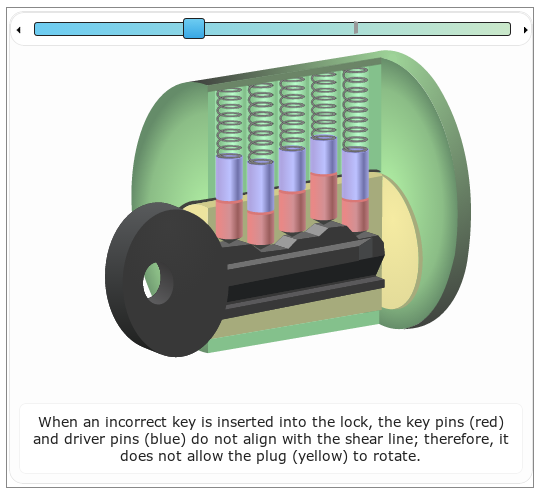

AnimationXBlock
===============

This XBlock shows students an animation they can go through. There is
a set of images with corresponding text, and a slider for going
through these images:

This is an intermediate point between video and text. Like text,
students can self-regulate pace of learning. Like a video, it has
somewhat reduced cognitive load, since the instructor can "point" to
things.

Next steps: 

* This looks good in workbench. There's a css issue where it is
  usable, but less pretty in edX.
* The slider uses a third-party library that doesn't seem to handle
  resizing well.
* Discoverability could be improved. The tool should either have
  instructions the first time it pops up, fade-in/fade-out text
  explaining slider, or at the very least, a tooltip.
* The slider knob should turn green when done. We add an animation_done 
  class when this happens; the CSS just needs to use it. 
* There should be an option for no text (if text is e.g. in the image)
* Conversely, there should be an option to embed XBlocks rather than
  just text+image. Audio XBlock, in particular, might be nice here. 
* Nicer styling
